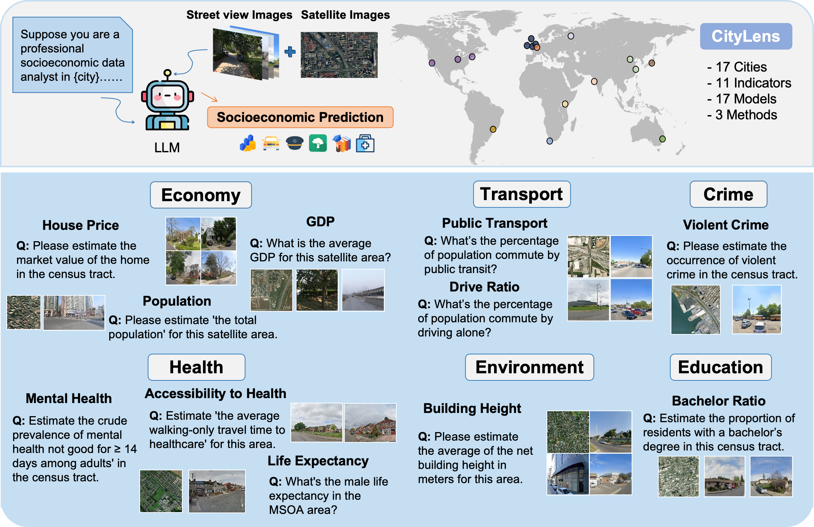
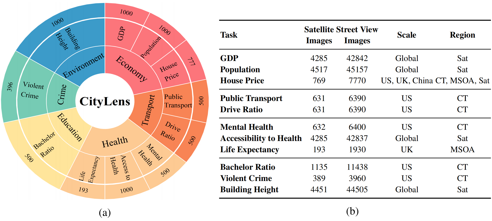

# CityLens

This repo is for CityLens: Evaluating Large Vision-Language Models for Urban Socioeconomic Sensing

## 📢 News

- 🎉: (2026.01) CityLens has been accepted to **ICLR 2026**.

## Introduction

In this work, we introduce ***CityLens***, a comprehensive benchmark designed to evaluate the capabilities of large vision-language models (LVLMs) in predicting socioeconomic indicators from satellite and street view imagery. We construct a multi-modal dataset covering a total of 17 globally distributed cities, spanning 6 key domains: economy, education, crime, transport, health, and environment, reflecting the multifaceted nature of urban life. Based on this dataset, we define 11 prediction tasks and utilize three evaluation paradigms: Direct Metric Prediction, Normalized Metric Estimation, and Feature-Based Regression. We benchmark 17 state-of-the-art LVLMs across these tasks. Our results reveal that while LVLMs demonstrate promising perceptual and reasoning capabilities, they still exhibit limitations in predicting urban socioeconomic indicators. CityLens provides a unified framework for diagnosing these limitations and guiding future efforts in using LVLMs to understand and predict urban socioeconomic patterns.

## 🌍 Framework

CityLens spans 11 real-world indicators across 6 socioeconomic domains, covering 17 globally distributed cities with diverse urban forms and development levels. To systematically assess model performance, we evaluate 17 different LVLMs using 3 distinct evaluation paradigms.



## 🌆 Task

This section defines the tasks designed to evaluate the capabilities of large vision-language models in predicting socioeconomic indicators at the regional level using satellite and street view imagery. As Figure a illustrates, ground-truth data for 28 indicators across six domains are initially collected, from which a final set of 11 indicators is derived to define the prediction tasks . As Figure b illustrates, tasks are defined at different spatial resolutions: census tract level for US-only indicators, MSOA level for UK-only indicators, and satellite image coverage level for global indicators. Each region is represented by satellite and street view imagery paired with corresponding socioeconomic indicator values.



## ⌨️ Codes Structure

- data_process # scripts for processing raw data
- evaluate # evaluation codes
- download_script # codes for download street view images
- config.py # global variables in project

## 🔧 Installation

Install Python dependencies.

```python
conda create -n citylens python==3.10
pip install -r requirements.txt
```

## 🤖 LVLM Support

For using LVLM API, you need to set API Key as follows

```python
export OpenAI_API_KEY = ""         # For OpenAI GPT3.5, GPT4, GPT4o
export DASHSCOPE_API_KEY = ""       # For QwenVL
export DeepInfra_API_KEY = ""        # For LLama3, Gemma, Mistral
export SiliconFlow_API_KEY = ""        # For InternLM or Qwen
```

## 🛠️ CityLens Evaluation System User Guide

CityLens provides two complete evaluation workflows for direct prediction tasks and feature-based regression tasks:

## Part1: Evaluation Data Preparation

The CityLens dataset is constructed to support the evaluation of large vision-language models (LVLMs) on region-level socioeconomic prediction tasks. The data preparation process consists of two main stages:

### 1. Ground Truth Collection

We collect ground-truth values for 28 candidate indicators across six domains: population, economy, housing, health, transportation, and safety. Based on perceptual relevance and redundancy reduction, 11 indicators are ultimately selected.

- **Perceptual relevance**: Whether a human (or a vision-language model) can reasonably infer the indicator from visual inputs such as satellite or street view imagery. Indicators without clear spatial cues (e.g., "personal miles traveled on a working weekday") are excluded.
- **Redundancy reduction**: Pearson correlation analysis is performed among semantically similar indicators. Highly correlated variables (e.g., obesity and mental health, r = 0.75) are filtered to avoid task duplication.

### 2. Urban Image Collection

Each region is represented by a combination of:

- **1 satellite image**, obtained from [Esri World Imagery](https://www.arcgis.com/home/item.html?id=226d23f076da478bba4589e7eae95952)
- **10 street view images**, collected via:
  - [Google Street View API](https://developers.google.com/maps/documentation/streetview) for most global cities
  - [Baidu Maps API](https://lbsyun.baidu.com/) for Beijing and Shanghai
  - [Mapillary API](https://www.mapillary.com/developer/) for open-source, crowdsourced street-level imagery

To balance computational efficiency and model compatibility, we limit the number of street view images to 10 per region. This setup ensures that input constraints of current LVLMs (e.g., Gemini) are met, while still preserving adequate visual context.

### 📂 Data Access

The full dataset is publicly available at:

👉 [https://huggingface.co/datasets/Tianhui-Liu/CityLens](https://huggingface.co/datasets/Tianhui-Liu/CityLens)

### ⚙️ Download Script Descriptions

`download_script/` folder is for Google and Baidu Street View data.  
- **Google Street View**
  - `utils_scp.py` — Preprocessing, parameter setting, and utility tools.  
  - `main_multi_scp_with_lanlon.py` — Image downloading script, you can use your own CSV including latitude and longitude to download images from Google.  
  - `cut_save.py` — Process and save image patches.  

- **Baidu Street View**
  - `utils.py` — Preprocessing, parameter setting, and utility tools.  
  - `baidu_crawler.py` — Image downloading script, you can use your own CSV including latitude and longitude to download images from Baidu.  

## Part2.1: Direct and Normalized Estimation

This section supports two prompting strategies:  
• **Simple prompt**: Directly requests model output of metric values  
• **Normalized prompt**: Asks model to output relative scores on a 0.0–9.9 scale  
Prompt type can choose `simple` or `normalized`.

### Economy

```python
# GDP
python -m evaluate.global.global_indicator --city_name="all" --mode="eval" --model_name="gpt-4o" --prompt_type="simple" --num_process=10 --task_name="gdp"
python -m evaluate.global.metrics --city_name="all" --model_name="gpt-4o" --prompt_type="simple" --task_name="gdp"

# house price
python -m evaluate.house_price.house_price_us --city_name="all" --mode="eval" --model_name="gpt-4o" --prompt_type="simple" --num_process=10
python -m evaluate.house_price.metrics --city_name="all" --model_name="gpt-4o" --prompt_type="simple" 

# population
python -m evaluate.global.global_indicator --city_name="all" --mode="eval" --model_name="gpt-4o" --prompt_type="simple" --num_process=10 --task_name="pop"
python -m evaluate.global.metrics --city_name="all" --model_name="gpt-4o" --prompt_type="simple" --task_name="pop"

```

### Education

```python
# bachelor ratio
python -m evaluate.education.bachelor_ratio --city_name="US" --mode="eval" --model_name="google/gemma-3-12b-it" --prompt_type="simple" 
python -m evaluate.education.metrics --city_name="US" --model_name="google/gemma-3-12b-it" --prompt_type="simple"  
```

### Crime

```python
# violent crime
python -m evaluate.crime.crime_us --city_name="US" --mode="eval" --model_name="meta-llama/Llama-4-Maverick-17B-128E-Instruct-FP8" --prompt_type="simple" --task_name="violent"
python -m evaluate.crime.metrics --city_name="US" --model_name="meta-llama/Llama-4-Maverick-17B-128E-Instruct-FP8" --prompt_type="simple" --task_name="violent"
```

### Transport

```python
# drive ratio
python -m evaluate.transport.transport_us --city_name="US" --mode="eval" --model_name="gpt-4o" --prompt_type="simple" --task_name="drive"
python -m evaluate.transport.metrics --city_name="US" --model_name="gpt-4o" --prompt_type="simple"  --task_name="drive"

# public transport
python -m evaluate.transport.transport_us --city_name="US" --mode="eval" --model_name="gpt-4o" --prompt_type="simple" --task_name="public"
python -m evaluate.transport.metrics --city_name="US" --model_name="gpt-4o" --prompt_type="simple"  --task_name="public"
```

### Health

```python
# mental health
python -m evaluate.health.health_us --city_name="US" --mode="eval" --model_name="google/gemma-3-4b-it" --prompt_type="simple" --task_name="mental"
python -m evaluate.health.metrics --city_name="US" --model_name="google/gemma-3-4b-it" --prompt_type="simple" --task_name="mental"

# life expectancy
python -m evaluate.life_exp.life_exp_uk --city_name="UK" --mode="eval" --model_name="google/gemma-3-4b-it" --prompt_type="simple"
python -m evaluate.life_exp.metrics --city_name="UK" --model_name="google/gemma-3-4b-it" --prompt_type="simple"

# accessibility to health
python -m evaluate.global.global_indicator --city_name="all" --mode="eval" --model_name="gpt-4o" --prompt_type="simple" --num_process=10 --task_name="acc2health"
python -m evaluate.global.metrics --city_name="all" --model_name="gpt-4o" --prompt_type="simple" --task_name="acc2health"
```

### Environment

```python
# building height
python -m evaluate.global.global_indicator --city_name="all" --mode="eval" --model_name="gpt-4o" --prompt_type="simple" --num_process=10 --task_name="build_height"
python -m evaluate.global.metrics --city_name="all" --model_name="gpt-4o" --prompt_type="simple" --task_name="build_height"
```

## Part2.2: Feature-Based Regression

This method follows a three-stage process:  
• **Feature extraction**: Extract 13 visual features from street view images  
• **Feature alignment**: Construct region-level feature vectors  
• **LASSO regression**: Predict socioeconomic indicators  

```python
# extract feature from LLM
python -m evaluate.feature.extract_feature
# extract answer from LLM
python extract_api.py
# align feature and reference
python feature.py
# LASSO regression
python regression.py
```

This evaluation system has been used for benchmarking all 17 cities and 11 metrics in our paper. Complete results are detailed in Chapter 6.

## 🌟 Citation

If you find this work helpful, please cite our paper.

```bash
@article{liu2025citylens,
  title={CityLens: Evaluating Large Vision-Language Models for Urban Socioeconomic Sensing},
  author={Liu, Tianhui and Pang, Hetian and Zhang, Xin and Ouyang, Tianjian and Zhang, Zhiyuan and Feng, Jie and Li, Yong and Pan, Hui},
  journal={arXiv preprint arXiv:2506.00530},
  year={2025}
}
```

## 👏 Acknowledgement

We appreciate the following GitHub repos a lot for their valuable code and efforts.

- https://github.com/0oshowero0/HealthyCities, for health-related ground truth data in UK cities
- https://github.com/rohinmanvi/GeoLLM, for normalized estimation approach
- https://github.com/brookefzy/urban-visual-intelligence, for extraction of 13 urban visual features

## 📩 Contact

If you have any questions or want to use the code, feel free to contact: Tianhui Liu (tianhuiliu06@gmail.com)
